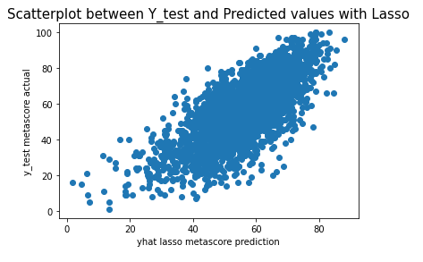
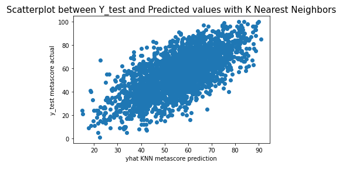
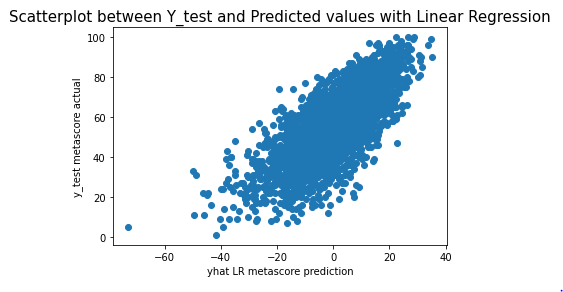
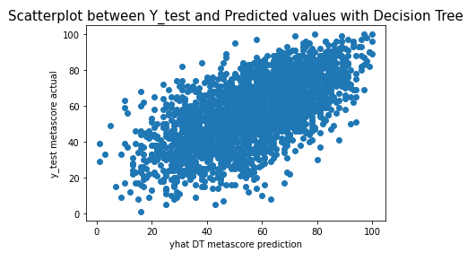

# Film Ratings

## Stat 426 Final Project

Movies are a phenomenon of entertainment that we enjoy on a daily basis. However, not all movies are made equal. There are certain films that reach new heights, while others fall short of our expectations.

One of the metrics we use to rate movies is known as a Metascore. The Metascore is a weighted average of ratings for a movie, which assign more importance to factors like critic reviews and certain publications. This score is supposed to be an objective rating of a film.

We decided that we would look into other forms of data, such as genre of movie, budget, and non-critic reviews to see if we could predict the Metascore of movies.

### The Data

We are using the "IMDb movies extensive dataset" from kaggle to perform this analysis. This dataset is split into a few CSV files, so we worked to compile the necessary information into a single file for analysis.
We performed the proper data cleaning to make sure that it could be used in a model.

A Correlation plot with the 'cool warm' colors showed that there was a high correlation between normal reviews and the Metascore. There are other positive and negative correlations that are weaker but just as interesting, such as Action, Comedy, and Horror movies perform worse than other genres such as Drama and Biography.

(Note : This is only a section of the plot, as the whole plot would be to large to fit here)

```
data = pd.read_csv('ratings_clean.csv')
corr = data.corr()
corr.syle.background_gradient(cmap='coolwarm')
```
<<<<<<< HEAD


### Analysis

We have all this data, and we have processed it using pipelines. We want to be able to predict the Metascore with all the other variables. to do this we will fit the data to 4 types of models.

- Lasso Regression
- K Nearest Neighbors Regression
- Linear Regression
- Decision Tree Regression

```
laspipe = Pipeline(steps=[('preprocessor', preprocessor),
                      ('regressor',  Lasso(alpha=.5))])

knnpipe = Pipeline(steps=[('preprocessor', preprocessor),
                      ('knn',  KNeighborsRegressor(n_neighbors=5))])

lrpipe = Pipeline(steps=[('preprocessor', preprocessor),
                      ('linearregression', LinearRegression(fit_intercept=False))])

dtpipe = Pipeline(steps=[('preprocessor', preprocessor),
                      ('decisiontreeregressor', DecisionTreeRegressor())])
```

At this point we have the models fitted with the appropriate data, and now we have to test to see how well they do. We can use a few metrics to test, and today we will be finding the cross validation scores for the  Mean Square Error (MSE), Mean Absolute Error (MAE), and Root Mean Squared Error (RMSE).

```
# Cross Validation score for Mean Absolute Error

# lasso
MAE_las = cross_val_score(laspipe, X_train, y_train, scoring='neg_mean_absolute_error')
print(np.mean(MAE_las)*-1)

9.954055146050106

# knn
MAE_knn = cross_val_score(knnpipe, X_train, y_train, scoring='neg_mean_absolute_error')
print(np.mean(MAE_knn)*-1)

10.110086327556242

# linear regression
MAE_lr = cross_val_score(lrpipe, X_train, y_train, scoring='neg_mean_absolute_error')
print(np.mean(MAE_lr)*-1)

55.94360681218829

# decision trees
MAE_dt = cross_val_score(dtpipe, X_train, y_train, scoring='neg_mean_absolute_error')
print(np.mean(MAE_dt)*-1)

12.220234259501556
```

```
# Cross Validation score for Mean Squared Error

# lasso
MSE_las = cross_val_score(laspipe, X_train, y_train, scoring='neg_mean_squared_error')
print(np.mean(MSE_las)*-1)

154.0117768943061

# knn
MSE_knn = cross_val_score(knnpipe, X_train, y_train, scoring='neg_mean_squared_error')
print(np.mean(MSE_knn)*-1)

162.22024677361998

# linear regression
MSE_lr = cross_val_score(lrpipe, X_train, y_train, scoring='neg_mean_squared_error')
print(np.mean(MSE_lr)*-1)

3274.046691663391

# decision trees
MSE_dt = cross_val_score(dtpipe, X_train, y_train, scoring='neg_mean_squared_error')
print(np.mean(MSE_dt)*-1)

240.77650113730147
```
```
# Cross Validation score for Root Mean Squared Error

# lasso
RMSE_las = cross_val_score(laspipe, X_train, y_train, scoring='neg_root_mean_squared_error')
print(np.mean(RMSE_las)*-1)

12.409150667849222

# knn
RMSE_knn = cross_val_score(knnpipe, X_train, y_train, scoring='neg_root_mean_squared_error')
print(np.mean(RMSE_knn)*-1)

12.735243529891704

# linear regression
RMSE_lr = cross_val_score(lrpipe, X_train, y_train, scoring='neg_root_mean_squared_error')
print(np.mean(RMSE_lr)*-1)

57.21908102086684

# decision trees
RMSE_dt = cross_val_score(dtpipe, X_train, y_train, scoring='neg_root_mean_squared_error')
print(np.mean(RMSE_dt)*-1)

15.600191607587442
```

Okay, that was a lot of code to look at to test the models. We can see that Linear Regression is the worst at predicting, with much higher error rates than the others. It looks like the Lasso model is much more accurate for this job. regardless, lets predict the scores using test data.

```
yhat_las = laspipe.predict(X_test)

# knn
yhat_knn = knnpipe.predict(X_test)

# linear regression
yhat_lr = lrpipe.predict(X_test)

# decision trees
yhat_dt = dtpipe.predict(X_test)
```

We now have an array of predictions for a Metascore. Lets visualize our data to see how well we did!

```
plt.scatter(yhat_las, y_test['metascore'])
plt.xlabel("yhat lasso metascore prediction")
plt.ylabel("y_test metascore actual")
plt.title("Scatterplot between Y_test and Predicted values with Lasso", fontsize=15)
```


```
plt.scatter(yhat_knn, y_test['metascore'])
plt.xlabel("yhat KNN metascore prediction")
plt.ylabel("y_test metascore actual")
plt.title("Scatterplot between Y_test and Predicted values with K Nearest Neighbors", fontsize=15)
```


```
plt.scatter(yhat_lr, y_test['metascore'])
plt.xlabel("yhat LR metascore prediction")
plt.ylabel("y_test metascore actual")
plt.title("Scatterplot between Y_test and Predicted values with Linear Regression", fontsize=15)
```


```
plt.scatter(yhat_dt, y_test['metascore'])
plt.xlabel("yhat DT metascore prediction")
plt.ylabel("y_test metascore actual")
plt.title("Scatterplot between Y_test and Predicted values with Decision Tree", fontsize=15)
```


### Conclusion
In all of the models, we were able to make a close prediction. the Linear Regression model was the weakest relationship of the bunch, but the other models worked relatively well.
=======

>>>>>>> 3c269dd755e2030a27b24230aa6a8a466df82b03
